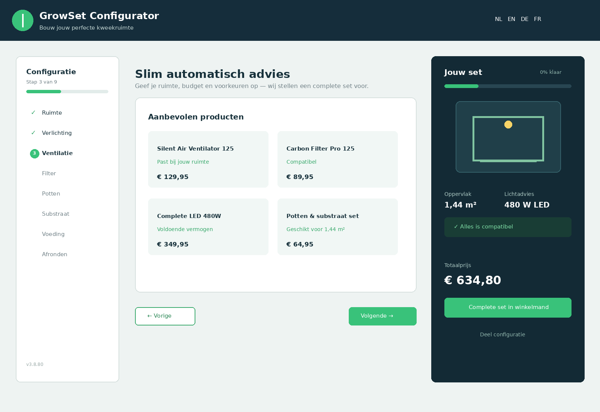
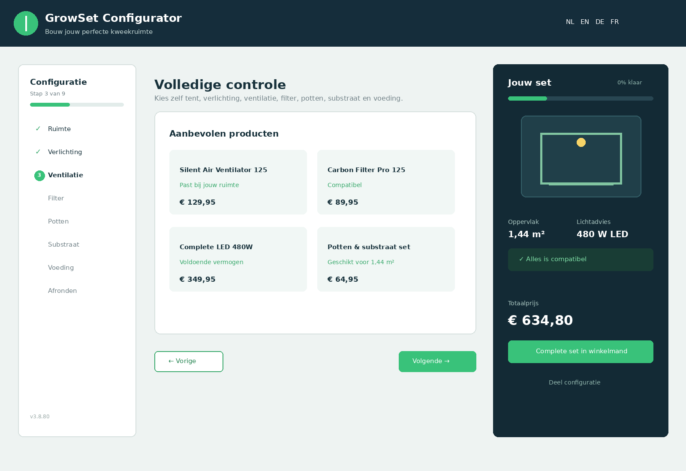
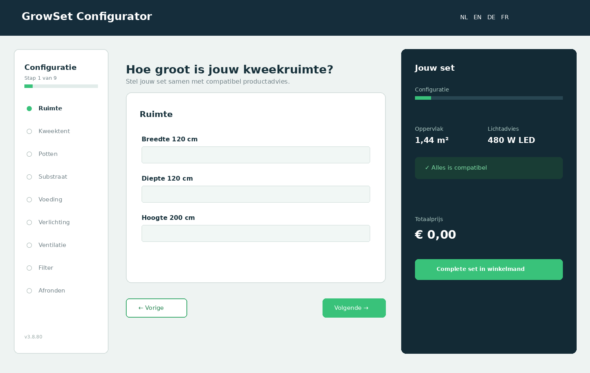
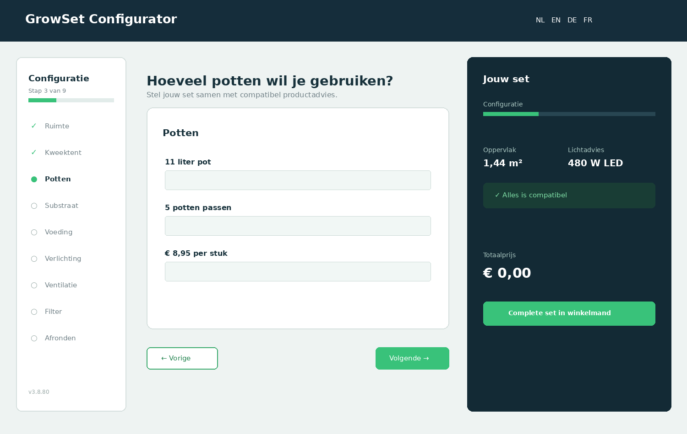
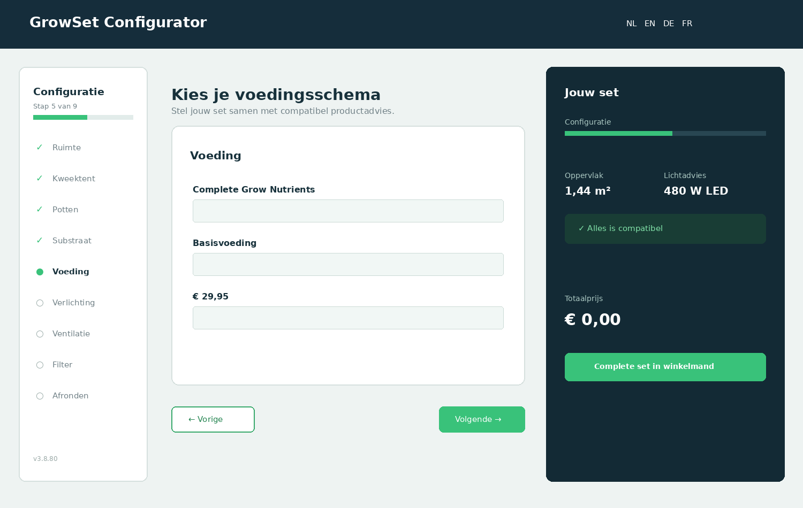
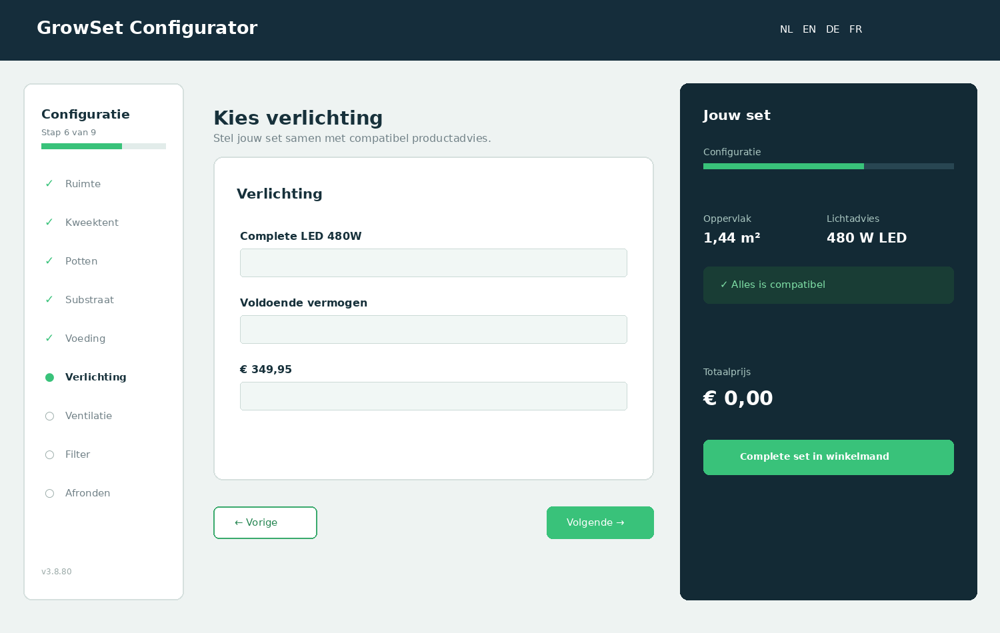
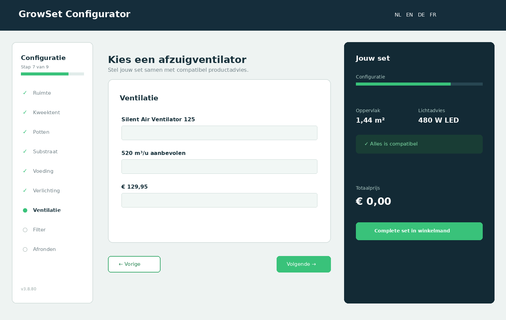
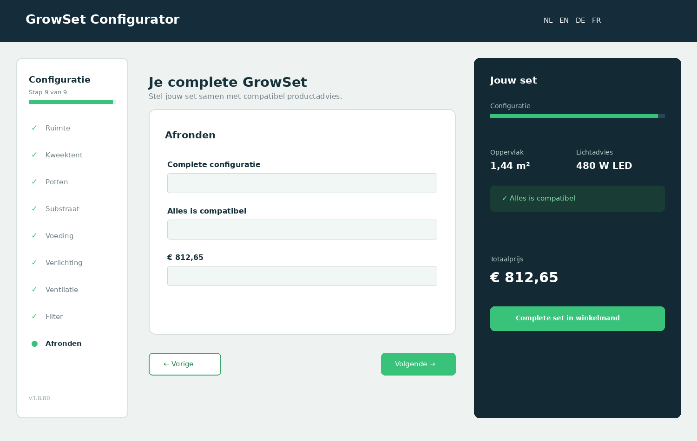
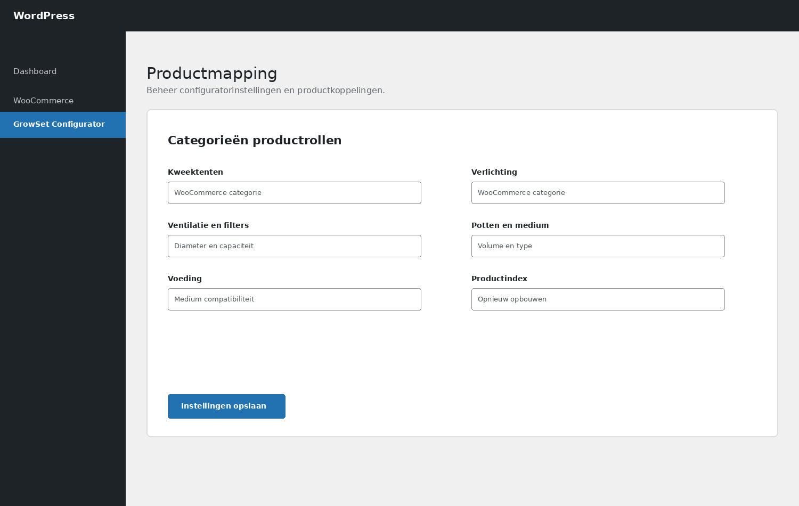

# WooCommerce GrowSet Configurator

Public showcase for the GrowSet Configurator for WooCommerce, version 3.8.80.

This repository contains only a product description and frontend showcase screenshots. It intentionally contains no ZIP files, PHP files, JavaScript, CSS, plugin code, product exports, credentials, or private shop URLs.

## What it does

The configurator guides a customer from available space to a compatible indoor-gardening setup. It combines WooCommerce products with sizing rules, technical requirements, compatibility checks, product scoring, price calculation, and a complete-set cart action.

## Customer-facing capabilities

### Three advice modes

- **Smart automatic** — the customer enters space, budget, priority, and desired completeness; the engine proposes complete configurations.
- **Quick advice** — a compact flow that selects sensible options with only a few questions.
- **Full control** — the customer chooses every component and can review the technical consequences.

### Nine guided steps

1. Space dimensions
2. Grow tent
3. Pots
4. Substrate or medium
5. Nutrients
6. Lighting
7. Ventilation
8. Carbon filter
9. Review and completion

The interface shows progress, supports previous/next navigation, and keeps the selected set visible while the customer works through the flow.

### Product matching and recommendations

- Matches products from real WooCommerce categories.
- Recommends tents that fit the entered floor area and height.
- Calculates target lighting power from surface area and selected advice mode.
- Calculates the required airflow from room volume and resistance correction.
- Checks fan/filter diameter compatibility.
- Checks whether pot quantities fit inside the selected tent.
- Handles product attributes, technical metadata, dimensions, wattage, airflow, diameter, capacity, PPFD, stock, price, images, and variations when available.
- Scores and explains recommendations instead of showing an unfiltered product list.

### Configuration summary

- Live surface area, lighting advice, and airflow metrics.
- Compatibility status and readable warnings for undersized lighting, ventilation, filters, or incompatible diameters.
- Selected products grouped by role with quantities and line totals.
- Total price using one WooCommerce currency.
- Add the complete set to the WooCommerce cart in one action.
- Save a configuration and share it through a compact URL.
- Clear all choices, including choices loaded from a shared URL.

### Presentation and accessibility

- Responsive layouts for desktop, tablet, and mobile.
- Keyboard-friendly controls and visible focus states.
- Dutch, English, German, and French interface translations.
- Multiple presentation templates: Modern Wizard, Compact Professional, Visual Product Cards, One Page, and Mobile First.
- Visual 3D and simple presentation variants.
- A clear no-JavaScript message when the browser has JavaScript disabled.

## Frontend screenshots

### Space and overview

### Smart automatic advice

### Full control

### Complete set summary

## WooCommerce and WordPress integration

- Delivered as a WooCommerce plugin using a shortcode-based frontend.
- Supports a configurable page and automatic configurator-page recovery.
- Uses WooCommerce products, categories, attributes, stock, images, prices, and variations.
- Supports configurable category slugs for tents, lighting, ventilation, filters, pots, saucers, medium, and nutrients.
- Supports authenticated configuration saving and controlled public read endpoints.
- Uses rate limiting and canonical validation for public API and AJAX flows.
- Keeps calculations and product processing local to the WordPress installation.

## Admin-side possibilities

The private administration area can configure category mappings, presentation mode, templates, product data checks, technical attributes, backups, imports, and exports. It can also rebuild the product index and test Smart Auto recommendations.

The admin product-data tools can export or back up only the products used by the configurator, then restore technical attributes and metadata by product ID, SKU, or name.

## Important note

The screenshots are neutral frontend showcase renders based on the configurator’s real user flow and interface structure. They do not expose a shop domain, customer data, product exports, or plugin files.

## Step-by-step frontend screenshots

The complete nine-step flow is shown below. Product names and example prices remain visible for demonstration.

1. 
2. 
3. 
4. 
5. 
6. 
7. 
8. 
9. 

## Backend screenshots

